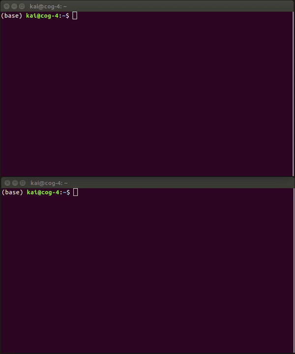

# 3D LiDAR Annotation Tool with pcd2bin Conversion Tool
## git clone from songanz/3D-LiDAR-annotator
UCSD Autonomous Vehicle Laboratory (AVL) 3D-LiDAR Annotation Tool

# OS and App Requirements
1. Ubuntu 16.04 LTS
2. Python 3.7.13
3. ROS Kinetic

# Pre-requisites
1. Converted the bag file to pcd files.

    

    * Run the command below in a Linux terminal:
        `roscore`
    * Run the following command in a **NEW** Linux terminal:
        `rosrun pcl_ros bag_to_pcd <input_file.bag> <topic> <output_directory>`

        
